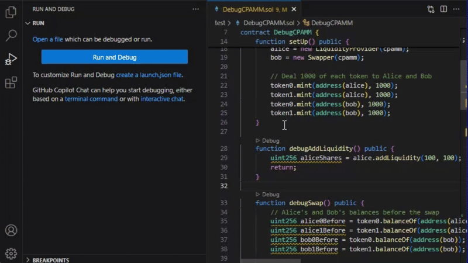
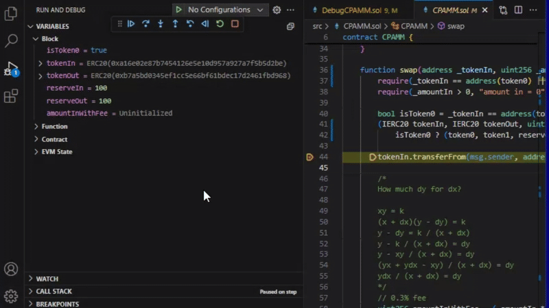
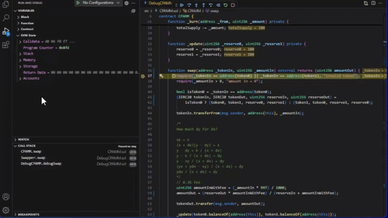

# Solidity Debugger for Visual Studio Code

Simbolik is a Solidity debugger for **Foundry** projects.
It allows you to step through your Solidity code line by line, set breakpoints and inspect variables.

## Quick Start

On first use Simbolik may ask for GitHub access. Alternatively, you can provide a Simbolik API key, [read more](https://docs.runtimeverification.com/simbolik/overview/getting-started).

Simbolik follows a **zero-configuration** approach where possible and falls back to **configuration-as-code** where needed.
For simple smart contracts, you can start debugging with just a single click on the `▷ Debug`-button.

For complex smart contracts, you set up your debugging session similarly to a Foundry unit test:
You first define a `setUp` function to initialize your contracts, and then provide a test function.
If the test function is public and does not have parameters, the `▷ Debug`-button shows up, [read more](https://docs.runtimeverification.com/simbolik/overview/starting-the-debugger#debuggable-functions).

## Inspect Variables

## Time Travel Debugging

## EVM Level Debugging

## Questions?

Do you have questions, or need help?

Visit our Documentation: https://docs.runtimeverification.com/simbolik \
Join our Discord: https://discord.gg/jnvEeDxW \
Join our TG group: https://t.me/rv_simbolik

