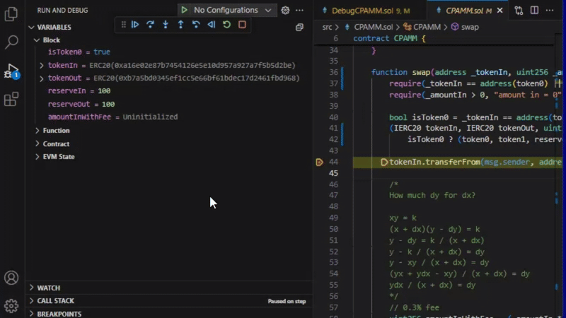
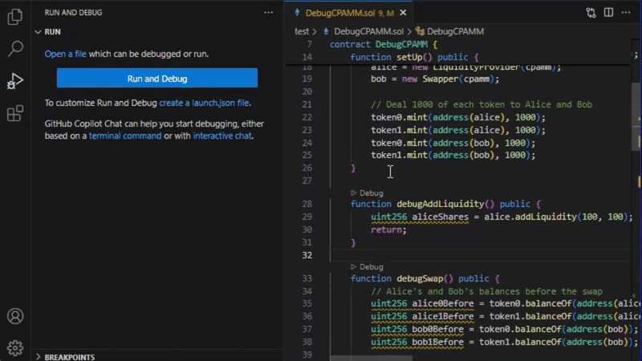
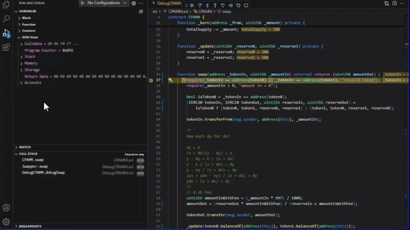

# Simbolik

**Solidity Debugger and Security Toolbox**

[Quick Start](#-quick-start) • [Documentation](#-documentation) • [Features](#-interactive-debugging-at-the-solidity-level)

Simbolik brings decades of research and engineering in software quality assurance to Solidity. It's an engineer's toolbox, including static analysis detectors, a breakpoint-style debugger, test case explorer, and code coverage reports, all integrated into a seamless experience in Visual Studio Code and Cursor.

## 🚀 Quick Start

On first use Simbolik may ask for GitHub access. Alternatively, you can provide a Simbolik API key, [read more](https://docs.runtimeverification.com/simbolik/overview/getting-started).

Simbolik follows a **zero-configuration** approach where possible and falls back to **configuration-as-code** where needed.
For simple smart contracts, you can start debugging with just a single click on the `▷ Debug`-button.

For complex smart contracts, you set up your debugging session similarly to a Foundry unit test:
You first define a `setUp` function to initialize your contracts, and then provide a test function.
If the test function is public and does not have parameters, the `▷ Debug`-button shows up, [read more](https://docs.runtimeverification.com/simbolik/overview/starting-the-debugger#debuggable-functions).

## 🐞 Interactive debugging at the Solidity level

A true source-level debugger is one of the most essential engineering tools for any serious developer. Simbolik goes far beyond console logs and deciphering massive stack traces—step through your Solidity code line by line, inspect variables at any point in execution, and leverage time-travel debugging to run your code backwards and forwards. This is the standard way software engineers debug in every other programming language, and now it's finally available for Solidity.

## 🔍 Foundry Test Explorer

See all your Foundry tests at a glance, run them individually or in groups. The test explorer makes it easy to understand your test suite's structure and quickly iterate on complex test scenarios. Combined with fuzzing support, you can systematically explore edge cases and corner conditions that manual testing might miss. Essential tools in any serious engineer's workflow for building robust, production-ready smart contracts.

## 📊 Test Coverage Reports

Understand exactly which lines of your code are covered by tests, and which aren't. Simbolik's code coverage reports give you detailed insights into your test suite's effectiveness, highlighting untested code paths and helping you identify gaps in your testing strategy. With this information at your fingertips, you can systematically improve your test coverage and ensure that critical edge cases are not overlooked.

## ⏱️ Time Travel Debugging

## 🛠️ EVM Level Debugging

## Questions?

Do you have questions, or need help?

Visit our Documentation: https://docs.runtimeverification.com/simbolik \
Join our Discord: https://discord.gg/CurfmXNtbN \
Join our TG group: https://t.me/rv_simbolik

